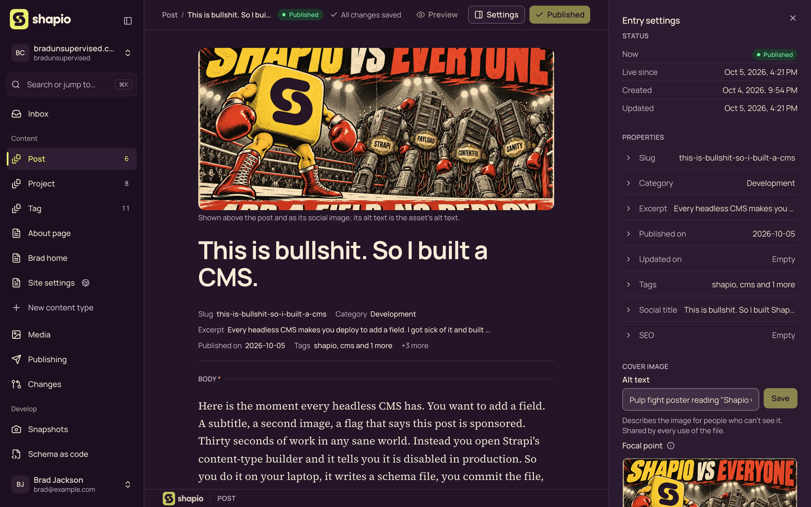
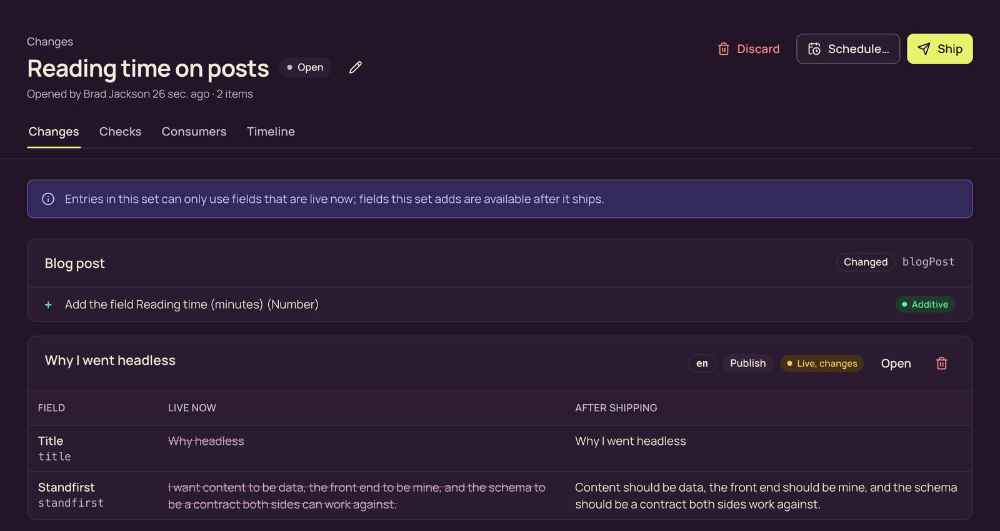
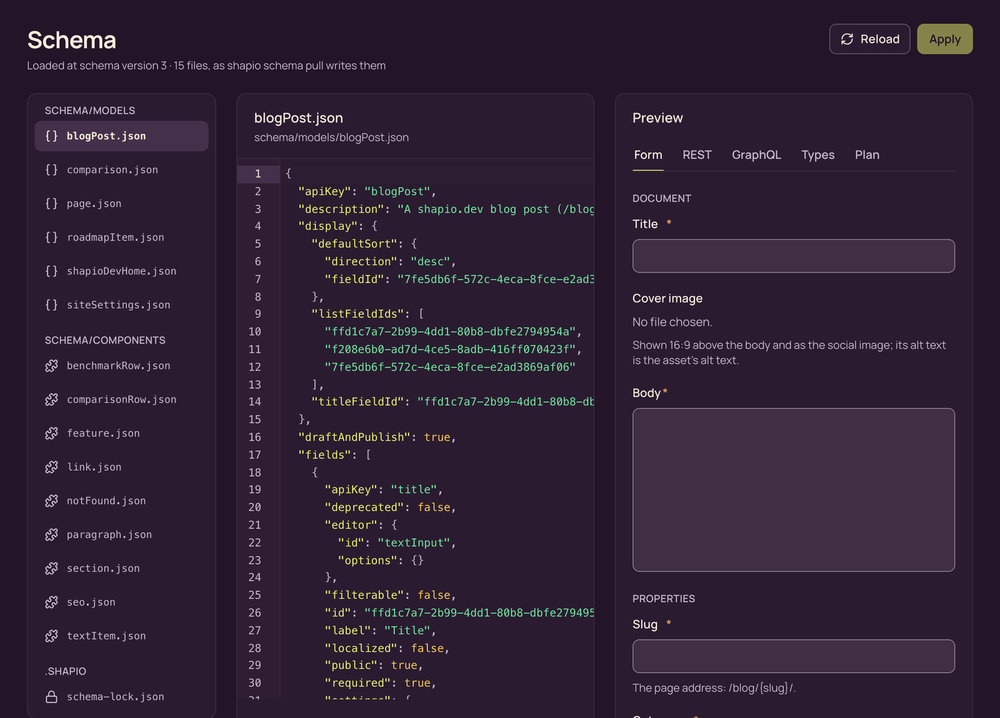
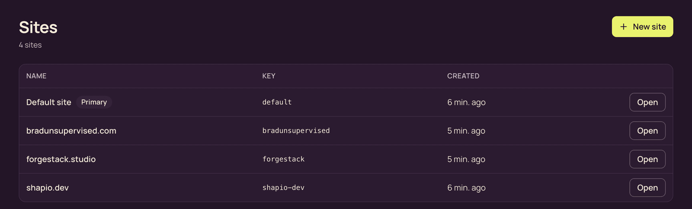
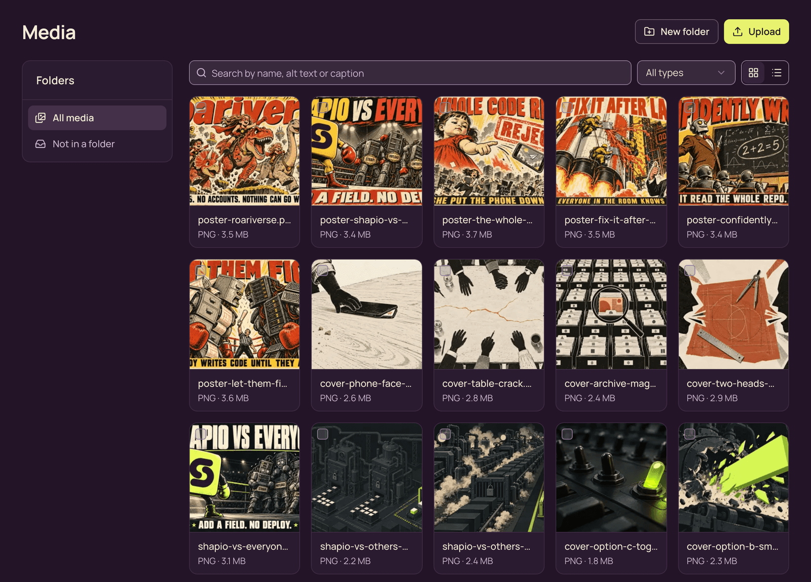

<p align="center">
  
</p>

<p align="center">
  <strong>The headless CMS you can change while it's live.</strong><br>
  Add a field in production. No rebuild, no restart, no deploy.
</p>

<p align="center">
  <a href="https://www.npmjs.com/package/@shapio/cms"></a>
  <a href="https://github.com/mybrokengnome/shapio/actions/workflows/ci.yml"></a>
  <a href="LICENSE"></a>
</p>

<p align="center">
  <a href="https://shapio.dev">Website</a> ·
  <a href="documentation/README.md">Docs</a> ·
  <a href="https://shapio.dev/blog/">Blog</a> ·
  <a href="https://shapio.dev/roadmap/">Roadmap</a>
</p>

<br>



Shapio is an open-source, self-hosted headless CMS. Your content models are data, not code, so you change them in
the admin while the site is running. Your sites and apps read the content over REST or GraphQL.

## Try it

```sh
npx create-shapio@latest my-cms --database-url sqlite:./shapio.db
cd my-cms
npm run start
```

Open `http://localhost:4300/admin/` and create your account. That's it.

Needs Node.js 24 or newer. SQLite is fine for a small site. For more traffic or more than one process, use
PostgreSQL 16+ or MySQL 8.4, or run the [Docker image](documentation/install-docker.md).

## What you get

### Change the model without a deploy

Add a field, rename one, add a whole content type. It goes live the moment you ship it. Nothing gets generated, no
table gets locked, nothing restarts.

### Review changes like a pull request



Model changes and content edits go into a change set. You see every field before and after, the checks tell you if
anything breaks, and it all ships together as one snapshot. Every snapshot stays readable, and restoring an old one
is just another change set.

### Keep your models in git



`shapio schema pull` writes your models to JSON files. Commit them, review them, and `shapio schema apply` puts them
back on any instance, live. If someone changed production since your last pull, apply refuses and shows the diff,
just like a rejected push.

### Many sites, one install



One Shapio runs as many sites as you want, with one login. Each site has its own content types, content, media,
tokens and end users. Share a content type across all of them when you want to.

### A media library you'll actually use



Alt text, captions, focal points and folders. Store files on disk or in S3.

### And the rest

- **Drafts on your dev server.** Save in the admin and see it on `localhost` before anyone else does.
- **Visual editing.** Your site sits next to the editor. Click part of the page and you land on its field.
- **Localization**, **revisions**, **scheduled publishing**, **custom roles** and an **audit log**.
- **End users.** People can sign up on your site and write content under the permissions you set.
- **Publishing hooks** for Cloudflare Pages, Vercel and Netlify, with real build status.
- **Starters** for Astro, Next.js and SvelteKit.
- **Importers** for WordPress and Strapi 5.
- **Nothing phones home.** Shapio sends no data anywhere unless you set it up to.

## Coming from somewhere else?

See how Shapio compares to [Strapi](https://shapio.dev/compare/strapi/),
[Payload](https://shapio.dev/compare/payload/) and [WordPress](https://shapio.dev/compare/wordpress/), or
[move a Strapi 5 project over](https://shapio.dev/blog/move-a-strapi-5-project-to-shapio/).

## Docs

Start with the [documentation index](documentation/README.md). The most useful pages:

- [Install with npm](documentation/install-npm.md) or [Docker](documentation/install-docker.md)
- [Modelling content](documentation/modelling.md)
- [Delivery API](documentation/delivery-api.md) and [GraphQL](documentation/graphql.md)
- [Change sets and snapshots](documentation/change-sets.md)
- [Site starters](documentation/starters.md)

## Contributing

Bug reports and pull requests are welcome. [CONTRIBUTING.md](CONTRIBUTING.md) covers running Shapio from a clone.
Security issues go to [SECURITY.md](SECURITY.md). What changed in each release is in the [changelog](CHANGELOG.md).

## License

[Apache 2.0](LICENSE)
